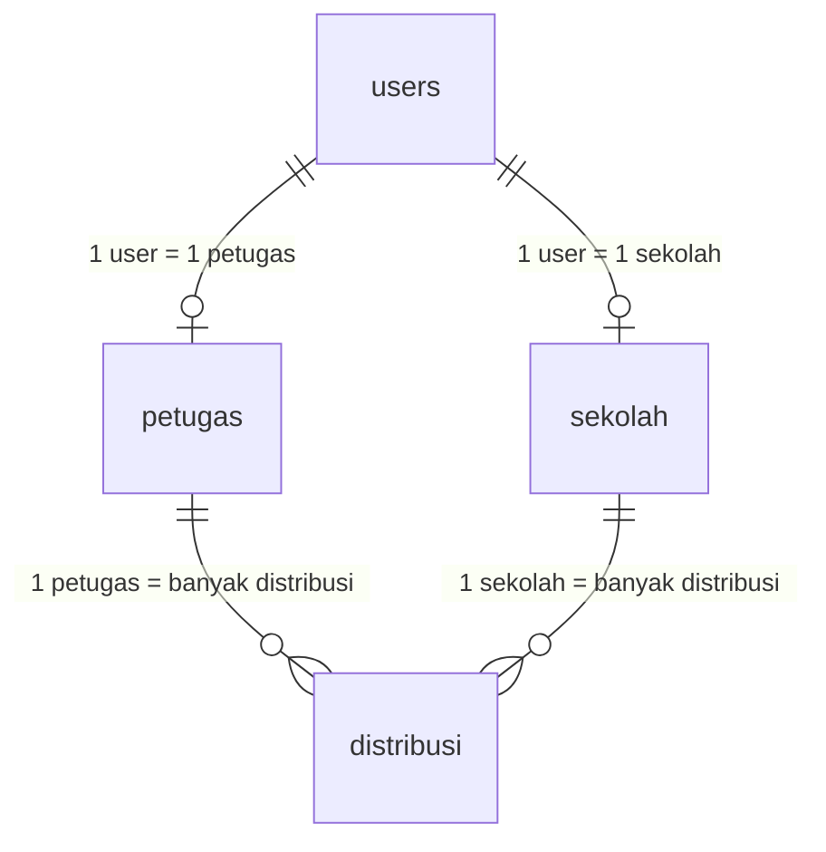

# Struktur Koding & Database - Aplikasi MBG

## 📁 Database

| Item | Keterangan |
|------|-----------|
| **Nama Database** | `database_mbg` |
| **Lokasi** | phpMyAdmin → `http://localhost/phpmyadmin` |
| **Server** | MySQL via XAMPP (`127.0.0.1:3306`) |
| **Username** | `root` (tanpa password) |
| **Konfigurasi** | [.env](file:///c:/xampp/htdocs/mbg_2/.env) (baris 23-28) |

### Tabel-Tabel Database

| Tabel | File Migration | Keterangan |
|-------|---------------|------------|
| `users` | [create_users_table.php](file:///c:/xampp/htdocs/mbg_2/database/migrations/0001_01_01_000000_create_users_table.php) | Semua akun login (admin, petugas, sekolah) |
| `sekolah` | [create_sekolah_table.php](file:///c:/xampp/htdocs/mbg_2/database/migrations/2026_04_23_143727_create_sekolah_table.php) | Data profil sekolah |
| `petugas` | [create_petugas_table.php](file:///c:/xampp/htdocs/mbg_2/database/migrations/2026_04_23_143920_create_petugas_table.php) | Data profil petugas |
| `distribusi` | [create_distribusi_table.php](file:///c:/xampp/htdocs/mbg_2/database/migrations/2026_04_23_143936_create_distribusi_table.php) | Jadwal pengiriman makanan |

### Seed Data Awal
- [DatabaseSeeder.php](file:///c:/xampp/htdocs/mbg_2/database/seeders/DatabaseSeeder.php) — membuat akun default admin, petugas (Slamet), dan sekolah (MIN 4)

---

## 🔐 Alur Login & Redirect

### File Utama
- **Halaman Login (View)**: [login.blade.php](file:///c:/xampp/htdocs/mbg_2/resources/views/login.blade.php)
- **Controller Login**: [AuthController.php](file:///c:/xampp/htdocs/mbg_2/app/Http/Controllers/AuthController.php)
- **Routes**: [web.php](file:///c:/xampp/htdocs/mbg_2/routes/web.php)

### Alur:
```
User buka http://127.0.0.1:8000
    ↓
Redirect ke /login (web.php baris 16)
    ↓
AuthController@showLogin (baris 11-18)
    ↓ (submit form)
AuthController@prosesLogin (baris 21-36)
    ↓ (cek email & password di tabel 'users')
AuthController@redirectBerdasarkanRole (baris 49-64)
    ↓
role = 'admin'   → /admin/dashboard
role = 'petugas' → /petugas/dashboard
role = 'sekolah' → /sekolah/dashboard
```

---

## 👤 Role Admin

### Routes (web.php baris 24-47)
Semua URL dimulai dengan `/admin/...`

### File-File Penting

| Fungsi | Controller | View |
|--------|-----------|------|
| **Dashboard** | [DashboardController.php](file:///c:/xampp/htdocs/mbg_2/app/Http/Controllers/Admin/DashboardController.php) | [dashboard.blade.php](file:///c:/xampp/htdocs/mbg_2/resources/views/admin/dashboard.blade.php) |
| **Data Sekolah** | [PenerimaController.php](file:///c:/xampp/htdocs/mbg_2/app/Http/Controllers/Admin/PenerimaController.php) | [admin/penerima/](file:///c:/xampp/htdocs/mbg_2/resources/views/admin/penerima/) |
| **Titik Distribusi** | [DistribusiController.php](file:///c:/xampp/htdocs/mbg_2/app/Http/Controllers/Admin/DistribusiController.php) | [admin/distribusi/](file:///c:/xampp/htdocs/mbg_2/resources/views/admin/distribusi/) |
| **Pengguna** | [PenggunaController.php](file:///c:/xampp/htdocs/mbg_2/app/Http/Controllers/Admin/PenggunaController.php) | [admin/pengguna/](file:///c:/xampp/htdocs/mbg_2/resources/views/admin/pengguna/) |
| **Laporan** | [LaporanController.php](file:///c:/xampp/htdocs/mbg_2/app/Http/Controllers/Admin/LaporanController.php) | [admin/laporan/](file:///c:/xampp/htdocs/mbg_2/resources/views/admin/laporan/) |
| **Layout** | - | [layouts/admin.blade.php](file:///c:/xampp/htdocs/mbg_2/resources/views/layouts/admin.blade.php) |

---

## 🚚 Role Petugas

### Routes (web.php baris 50-56)
Semua URL dimulai dengan `/petugas/...`

### File-File Penting

| Fungsi | Method di Controller | View |
|--------|---------------------|------|
| **Dashboard** | `index()` | [dashboard.blade.php](file:///c:/xampp/htdocs/mbg_2/resources/views/petugas/dashboard.blade.php) |
| **Halaman Konfirmasi** | `halamanKonfirmasi()` | [konfirmasi.blade.php](file:///c:/xampp/htdocs/mbg_2/resources/views/petugas/konfirmasi.blade.php) |
| **Proses Konfirmasi** | `konfirmasi()` | *(redirect, tidak ada view)* |
| **Riwayat** | `riwayat()` | [riwayat.blade.php](file:///c:/xampp/htdocs/mbg_2/resources/views/petugas/riwayat.blade.php) |
| **Profil** | `profil()` | [profil.blade.php](file:///c:/xampp/htdocs/mbg_2/resources/views/petugas/profil.blade.php) |

- **Controller**: [DashboardPetugasController.php](file:///c:/xampp/htdocs/mbg_2/app/Http/Controllers/Petugas/DashboardPetugasController.php)
- **Layout**: [layouts/petugas.blade.php](file:///c:/xampp/htdocs/mbg_2/resources/views/layouts/petugas.blade.php)

---

## 🏫 Role Sekolah

### Routes (web.php baris 59-65)
Semua URL dimulai dengan `/sekolah/...`

### File-File Penting

| Fungsi | Method di Controller | View |
|--------|---------------------|------|
| **Dashboard** | `index()` | [dashboard.blade.php](file:///c:/xampp/htdocs/mbg_2/resources/views/sekolah/dashboard.blade.php) |
| **Konfirmasi Terima** | `konfirmasi()` | [konfirmasi.blade.php](file:///c:/xampp/htdocs/mbg_2/resources/views/sekolah/konfirmasi.blade.php) |
| **Proses Konfirmasi** | `storeKonfirmasi()` | *(redirect, tidak ada view)* |
| **Riwayat** | `riwayat()` | [riwayat.blade.php](file:///c:/xampp/htdocs/mbg_2/resources/views/sekolah/riwayat.blade.php) |
| **Profil** | `profil()` | [profil.blade.php](file:///c:/xampp/htdocs/mbg_2/resources/views/sekolah/profil.blade.php) |

- **Controller**: [DashboardSekolahController.php](file:///c:/xampp/htdocs/mbg_2/app/Http/Controllers/Sekolah/DashboardSekolahController.php)
- **Layout**: [layouts/sekolah.blade.php](file:///c:/xampp/htdocs/mbg_2/resources/views/layouts/sekolah.blade.php)

---

## 🔄 Alur Konfirmasi Pengiriman (Seperti J&T Express)

```
Admin input jadwal distribusi di /admin/distribusi/create
    ↓ (status: "Belum Dikirim")
    
Petugas login → lihat tugas di /petugas/konfirmasi
    ↓ klik "Konfirmasi Mulai Pengiriman"
    ↓ (status berubah: "Dalam Perjalanan")
    
Sekolah login → lihat di /sekolah/konfirmasi
    ↓ (form aktif karena status = "Dalam Perjalanan")
    ↓ isi jumlah diterima + upload foto
    ↓ klik "Konfirmasi Pesanan Diterima"
    ↓ (status berubah: "Selesai")
    
Admin bisa pantau semua status di:
    - /admin/dashboard (tabel aktivitas terbaru)
    - /admin/distribusi (tabel distribusi + badge status)
```

---

## 📦 Model (Penghubung ke Database)

| Model | File | Tabel |
|-------|------|-------|
| User | [User.php](file:///c:/xampp/htdocs/mbg_2/app/Models/User.php) | `users` |
| Sekolah | [Sekolah.php](file:///c:/xampp/htdocs/mbg_2/app/Models/Sekolah.php) | `sekolah` |
| Petugas | [Petugas.php](file:///c:/xampp/htdocs/mbg_2/app/Models/Petugas.php) | `petugas` |
| Distribusi | [Distribusi.php](file:///c:/xampp/htdocs/mbg_2/app/Models/Distribusi.php) | `distribusi` |

### Relasi Antar Tabel


